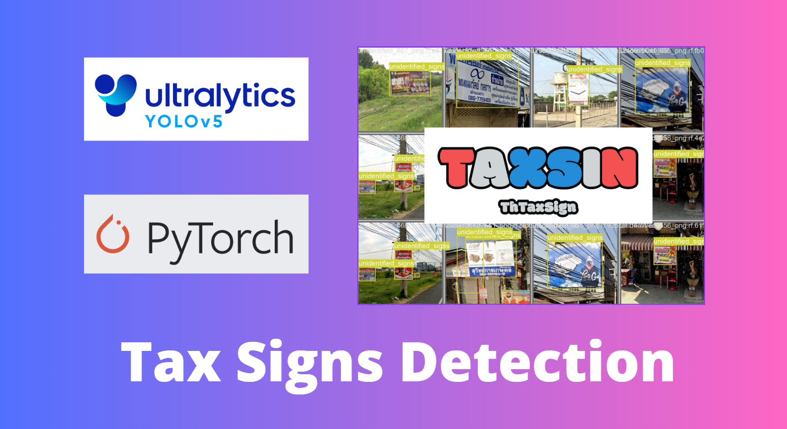
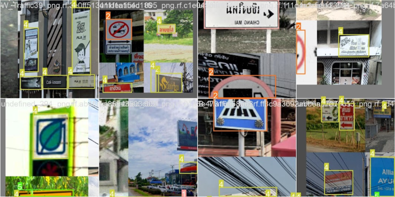
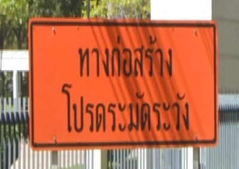
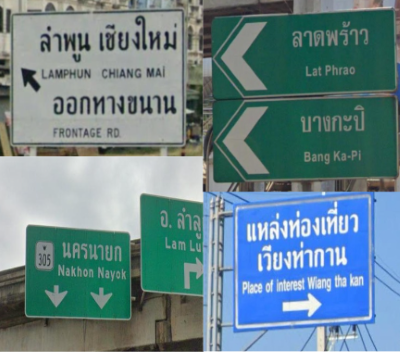
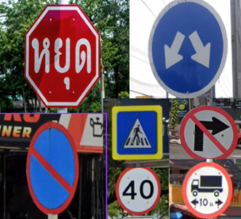
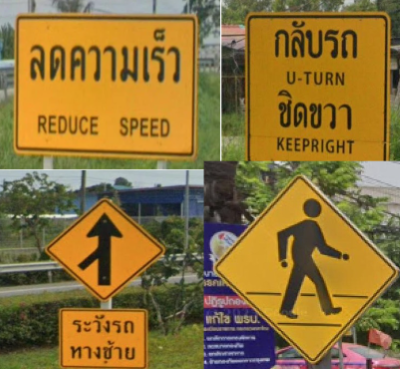
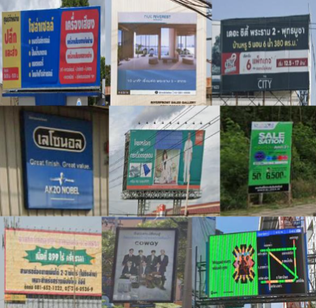
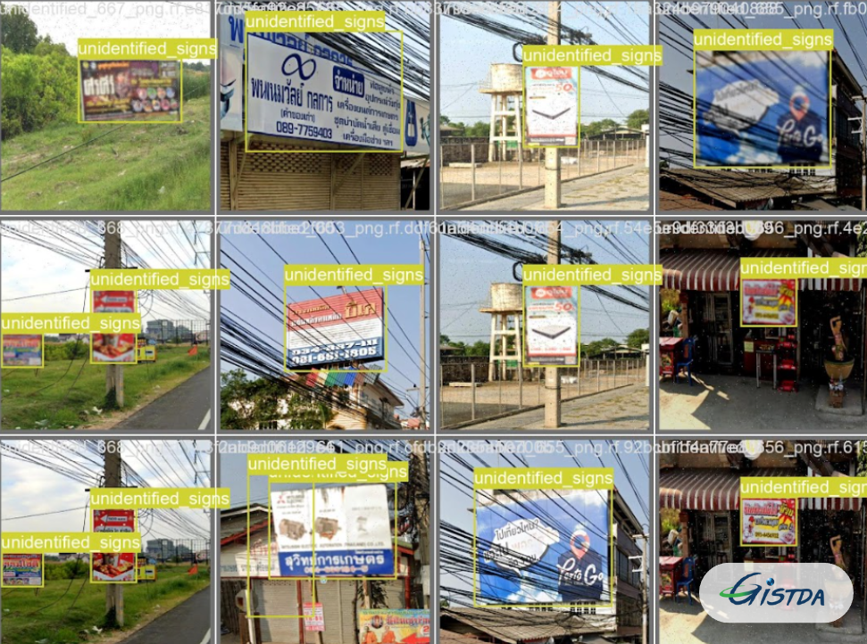

# Home

## What is ThTaxSign ?
ThTaxSign is a custom object detection model trained on the YOLOv5 architecture, specifically designed to detect road signs or municipal tax signs in Thailand. Leveraging the robustness and efficiency of YOLOv5, ThTaxSign excels at accurately identifying various types of road signs commonly found on Thai roads, including regulatory signs, warning signs, construction signs, guidepost signs, soi/road signs and unidentified signs.

Trained on a diverse dataset consisting of annotated images of Thai road signs, ThTaxSign has learned to recognize and localize signs with high precision and reliability. This model is optimized to perform well under various environmental conditions, including different lighting conditions, weather conditions, and viewing angles commonly encountered on Thailand roads.

The municipal tax sign detection in this model is categorized under "unidentified signs" due to the absence of distinct shapes or clearly defined colors. Municipal tax signs may resemble advertisements, store signs, or brand signs with specific colors and shapes, thus falling into this category. Users are required to further differentiate these signs based on visual cues after detection of unidentified signs.

## Catagories of ThTaxSign model

The signs of this model are divided into six categories, including construction signs, guide post signs, regulatory signs, soi/road signs, warning signs, and unidentified signs.

- Construction sign

- Guide Post sign

- Regulatory sign

- Soi/Road sign

- warning sign

- unidentified sign

## The purpose of this project

This project was developed under the [GISTDA](https://www.gistda.or.th/home.php) (Geo-Informatics and Space Technology Development Agency, Thailand ) initiative to detect various Municipal tax signs such as shop signs, advertisements, and other signs from street view images.

<!-- For full documentation visit [mkdocs.org](https://www.mkdocs.org).

## Commands

* `mkdocs new [dir-name]` - Create a new project.
* `mkdocs serve` - Start the live-reloading docs server.
* `mkdocs build` - Build the documentation site.
* `mkdocs -h` - Print help message and exit.

## Project layout

    mkdocs.yml    # The configuration file.
    docs/
        index.md  # The documentation homepage.
        ...       # Other markdown pages, images and other files. -->
