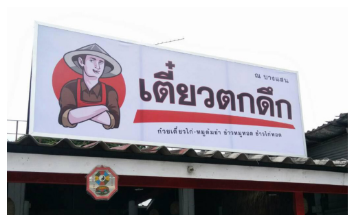
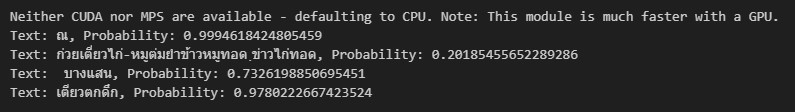
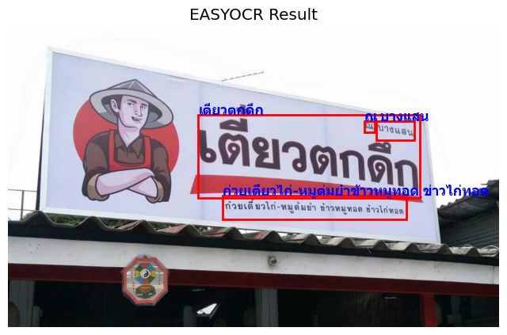
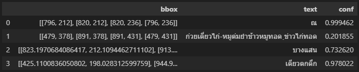

# EasyOCR

## What os EasyOCR 

EasyOCR is a Python computer language Optical Character Recognition (OCR) module that is both flexible and easy to use. OCR technology is useful for a variety of tasks, including data entry automation and image analysis. It enables computers to identify and extract text from photographs or scanned documents.

EasyOCR stands out for its dedication to making OCR implementation easier for developers. It’s made to be user-friendly even for people with no background in OCR or computer vision. Multiple language support, pre-trained text detection and identification models, and a focus on speed and efficiency in word recognition inside images are all provided by the library.


## Supported Languages By EasyOCR

EasyOCR is currently supporting 80+ languages with more languages in development. Supported languages with the code name are listed below:

Abaza (abq), Adyghe (ady), Afrikaans (af), Angika (ang), Arabic (ar), Assamese (as), Avar (ava), Azerbaijani (az), Belarusian (be), Bulgarian (bg) , Bihari (bh), Bhojpuri (bho), Bengali (bn), Bosnian (bs), Simplified Chinese (ch_sim), Traditional Chinese (ch_tra), Chechen (che), Czech (cs), Welsh (cy), Danish (da), German (de), English (en), Spanish (es), Estonian (et), Persian (fa), Finnish (fi), French (fr), Irish (ga), Goan Konkani (gom), Hindi (hi), Croatian (hr), Hungarian (hu), Indonesian (id), Ingush (inh), Icelandic (is), Italian (it), Japanese (ja), Kabardian (kbd), Kannada (kn), Korean (ko), Kurdish (ku), Latin (la), Lak (lbe), Lezghian (lez), Lithuanian (lt), Latvian (lv), Magahi (mah), Maithili (mai), Maori (mi), Mongolian (mn), Marathi (mr), Malay (ms), Maltese (mt), Nepali (ne), Newari (new), Dutch (nl), Norwegian (no), Occitan (oc), Pali (pi), Polish (pl), Portuguese (pt), Romanian (ro), Russian (ru), Serbian (cyrillic) (rs_cyrillic), Serbian(latin) (rs_latin), Nagpuri (sck), Slovak (sk), Slovenian (sl), Albanian (sq), Swedish (sv), Swahili (sw), Tamil (ta), Tabassaran (tab), Telugu (te), Thai (th), Tajik (tjk), Tagalog (tl), Turkish (tr), Uyghur (ug), Ukranian (uk), Urdu (ur), Uzbek (uz), Vietnamese (vi)


## How to use EasyOCR

### Part of Command Prompt

Set up your python environment before the Installation.

#### Install library

Defualt is only English.

```python

pip install easyocr

```

#### Install library for Thai language

```python

pip install easyocr[Thai]

```

### Part of code editor

like VScode or Jupyter notebook

#### Import library

```python

import cv2
import easyocr
import numpy as np
import matplotlib.pyplot as plt
import pandas as pd
from glob import glob

plt.style.use('ggplot')

```

#### Input Observation

```python

# dataset path
test_imgs = glob('dataset/*')

image = test_imgs[9]

img=cv2.imread(image)

plt.axis("off")
plt.imshow(cv2.cvtColor(img, cv2.COLOR_BGR2RGB))
plt.show()

```



#### Text Extraction by using EasyOCR

```python

# Extract text
reader = easyocr.Reader(['th','en']) # specify the language  
res = reader.readtext(image)

for (bbox, text, prob) in res:
    (top_left, top_right, bottom_right, bottom_left) = bbox 
    print(f'Text: {text}, Probability: {prob}')

```



#### Display result

```python

# Plot image and its annotations
img = plt.imread(image)
fig, ax = plt.subplots(figsize=(8, 8))
ax.imshow(img)

for (bbox, text, prob) in res:
    (top_left, top_right, bottom_right, bottom_left) = bbox 
    # Draw bounding box
    rect = plt.Rectangle(top_left, width=(bottom_right[0] - top_left[0]), 
                             height=(bottom_right[1] - top_left[1]), 
                             linewidth=2, edgecolor='r', facecolor='none')
    ax.add_patch(rect)

    # Annotate with text 
    ax.text(top_left[0], top_left[1], f'{text}', va='baseline', color='blue', fontweight = 'heavy', fontfamily = 'Tahoma', fontsize = 'large')

ax.set_title('EASYOCR Result')
plt.axis('off')
plt.show()

pd.DataFrame(res, columns=['bbox', 'text', 'conf'])

```








##### If you want to extract mutiple images files, Follow this nbviewer ⚠️

<a href="https://nbviewer.org/github/DreamPTK/ThTaxSigns/blob/main/easyocrs.ipynb"></a>
