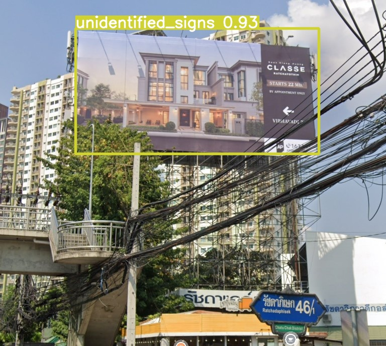
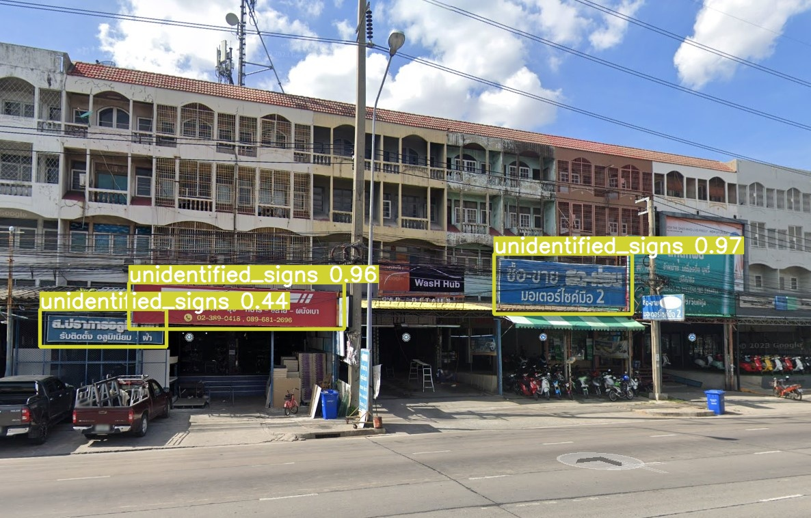
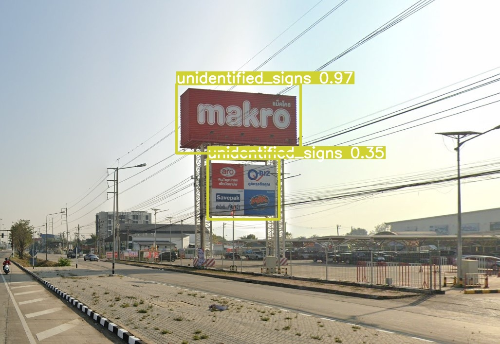
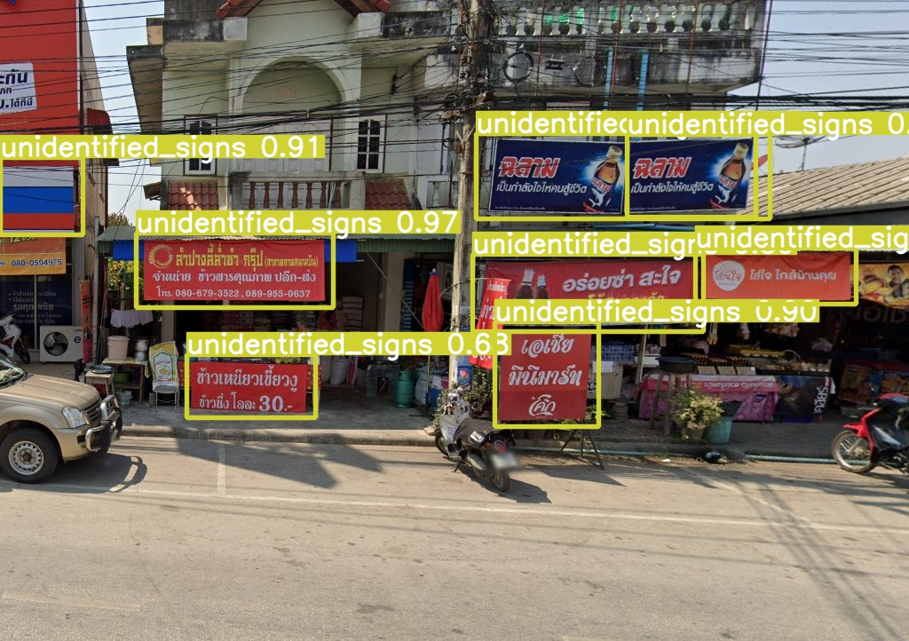
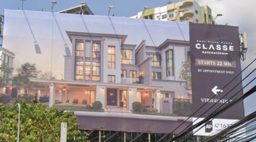
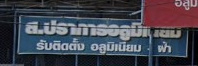
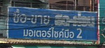
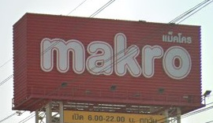
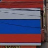

# Get Started

<a href="https://nbviewer.org/github/DreamPTK/yolov5/blob/master/detect.ipynb"></a>

## In Anaconda Prompt or the Terminal

    cd your_directory

### Creating new virtual environment
Create new folder name: "sign_project" on your directory. Put your own environment name instead of "envName" or you can you this name.

    mkdir sign_project
    cd sign_project
    python -m venv envName

### Activate your environment 

    envName\Scripts\activate.bat


<!-- ### Installation

    pip install ThTaxSigns -->


<!-- open new terminal (command line) -->

### Using Git clone to set up the model tools
[how to set up git click >>](https://stackpython.medium.com/%E0%B8%97%E0%B8%B3%E0%B8%84%E0%B8%A7%E0%B8%B2%E0%B8%A1%E0%B8%A3%E0%B8%B9%E0%B9%89%E0%B8%88%E0%B8%B1%E0%B8%81-git-github-%E0%B8%9E%E0%B8%A3%E0%B9%89%E0%B8%AD%E0%B8%A1%E0%B8%81%E0%B8%B2%E0%B8%A3%E0%B9%83%E0%B8%8A%E0%B9%89%E0%B8%87%E0%B8%B2%E0%B8%99%E0%B8%A3%E0%B9%88%E0%B8%A7%E0%B8%A1%E0%B8%81%E0%B8%B1%E0%B8%9A-vs-code-%E0%B9%80%E0%B8%9A%E0%B8%B7%E0%B9%89%E0%B8%AD%E0%B8%87%E0%B8%95%E0%B9%89%E0%B8%99-f848f41a39e9)

```

git clone https://github.com/DreamPTK/yolov5.git

```
### Open Visual Studio Code (VScode)

```
code .

```


## In Visual Studio Code (VScode)

Open `detect.ipynb` on `yolov5` folder and

Open New Terminal in Vscode (command Prompt)

```
cd yolov5
pip install -qr requirements.txt  

```

### Import module and set up tools

In `detect.ipynb`

```
import os
import utils
display = utils.notebook_init()

```

### Detection Sign image

The `detect.py` run ThTaxSign model on all images source of `data/images` folder and save the result to `output/exp` folders.

This case study have two images source on `data/images` folder.

```
# use ThTaxSign model to detect 
!python detect.py --img 640 --weights ThTaxSigns/data/models.pt --conf 0.3  --source ThTaxSigns/data/images --project ThTaxSigns/data/output --save-crop

```
 `--img`: inference size (height, width)

`--weights`: model path or triton URL

`--conf`: confidence threshold

`--source`: file/dir/URL/glob/screen/webcam (source of the image)

`--project`: save results to project/name

`--save-crop`: save cropped prediction boxes

[Other option you can read more !!!](https://github.com/ultralytics/yolov5/blob/master/detect.py)


### Display output

```
# Display image

import glob
from IPython.display import Image, display

for imageName in glob.glob('ThTaxSigns/data/output/exp/*.jpg'): 
    display(Image(filename=imageName))
    print("\n")

```













### Display crop output

This tool will separatly crop the sign image output to several image files.

```
# Display all crop images

for imageName in glob.glob('ThTaxSigns/data/output/exp/crops/unidentified_signs/*.jpg'): 
    display(Image(filename=imageName,width=300))
    print("\n")

```















Finally, you can see these crop image outputs on `output/exp/crops/unidentified_signs` folder.


