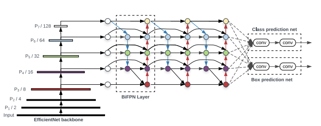

# YOLOv5

## What is YOLOv5
YOLOv5 is a prominent member of the YOLO (You Only Look Once) series of computer vision models developed by [Ultralytics](https://www.ultralytics.com/), widely employed for object detection tasks in various applications such as autonomous driving, surveillance, and image understanding. YOLOv5 distinguishes itself with its efficiency and accuracy, providing real-time object detection capabilities [More](https://docs.ultralytics.com/yolov5/). 

## YOLOv5 Architecture
[YOLOv5 Architecture](https://docs.ultralytics.com/yolov5/tutorials/architecture_description/#2-data-augmentation-techniques)

Object detection, a use case for which YOLOv5 is designed, involves creating features from input images. These features are then fed through a prediction system to draw boxes around objects and predict their classes [More](https://medium.com/analytics-vidhya/object-detection-algorithm-yolo-v5-architecture-89e0a35472ef). 

### The benefits and potential of YOLOv5

<iframe width="600" height="400" src="https://www.youtube.com/embed/iSXPMH3Wfig?si=-Vy69l7ZRy3CJbKd" title="Simpler, Smarter, Further: YOLOv5 and the Future of Visual AI" frameborder="0" allow="accelerometer; autoplay; clipboard-write; encrypted-media; gyroscope; picture-in-picture; web-share" referrerpolicy="strict-origin-when-cross-origin" allowfullscreen></iframe>

